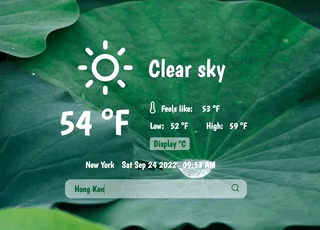

# Weather App
## Demo
Click [here](https://wukongo-o.github.io/weather-app/) to check out the weather app! 🌞 🌊 ⛄️ 🌈

## Description
I created the weather forecast app with the OpenWeatherMap API. The app uses promises to fetch and process JSON data based on user input.

## Features
- Search current weather by location name
- Toggle displaying temperature in Fahrenheit or Celsius 
- Display loading animation while waiting for the data
- Responsive design 

## Built with
Pure JavaScript, SCSS, HTML